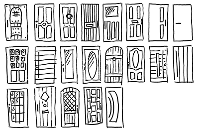

# 1. Config

- Reset (Normalize)
- Configuring (SCSS by element: desktop / mobil)
  - Space (padding, margin, line-height, etc.)
  - Color and tints
  - Breakpoints
  - Border radius

# 2. Sources

### Global
  - Color and tints
  - Fonts
  - Space (padding, margin, line-height, etc.)
  - Breakpoints
  - Border radius
  - Animation (fade, bounces, etc.)
  - Visibility
  - Float

### Text (Typography)
  - Headings
  - Paragraph
  - Blockquote
  - Inline Elements
  - Time
  - Hr

### Lists
  - UL
  - LI
  - OL

### Buttons

### Images
  - Logo
  - Favicons
  - Icons
  - Loading Icon

### Code

### Forms

  - Text Fields
    - input[type="text"]
    - input[type="password"]
    - input[type="url"]
    - input[type="email"]
    - input[type="search"]
    - input[type="number"]
    - textarea
    - Bonus: html5 inputs

  - Select menu
  - Checkbox
  - Radio Buttons

  - Error
  - Valid
  - Disable

### Tables

### Animation (fade, bouncs, etc.)
### Alerts
### Tooltip
### Utility classes
### Embed (and responsive embed)

# 3. Modules

### Native

- Text
- Blocks
- Media
- Forms
- Navigation
- Components
- Messaging

- Breakpoint
- Layout (Container / Grid / Column)

### Plugins

- :nth-child
- Mobile nav
- Modal
- Dropdown
- Tab
- Slider
- Player audio / video
- inputRange
- Collapse / Accordion
- Push notification

# 4. Components

- Header
- Footer
- Article
- Comments
- Posts

# 5. Templates

- Head (https://github.com/joshbuchea/HEAD)
- Homepage
- Article
- Etc.

---

      |─────|
      |     |
      |─── /|
      |  /  |
      |/────|
    Front Doors
    
---

**NEXT STEP : The Backdoor :)**
